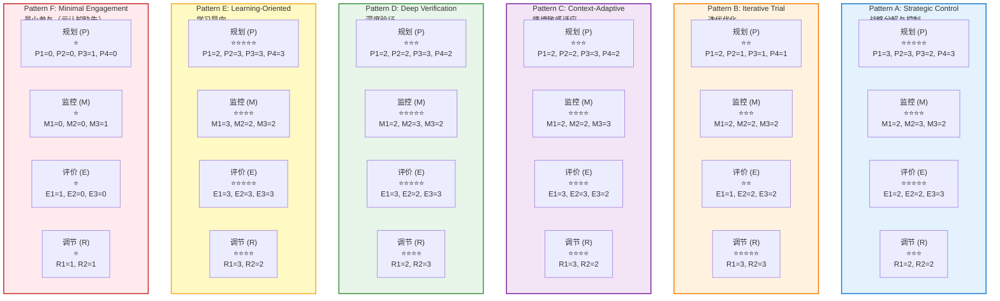
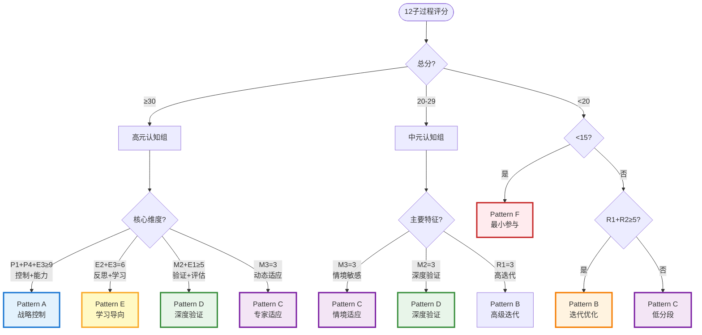
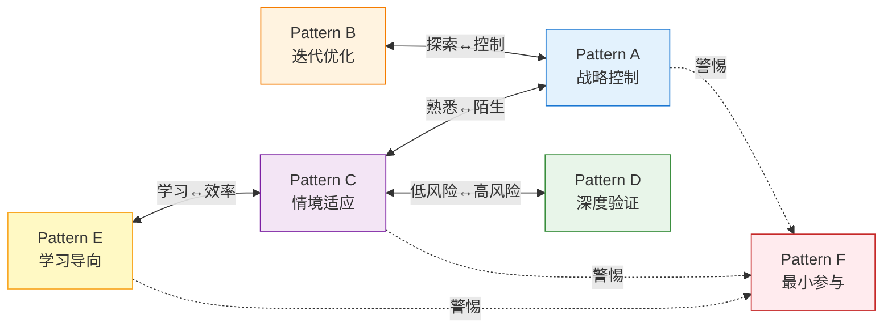
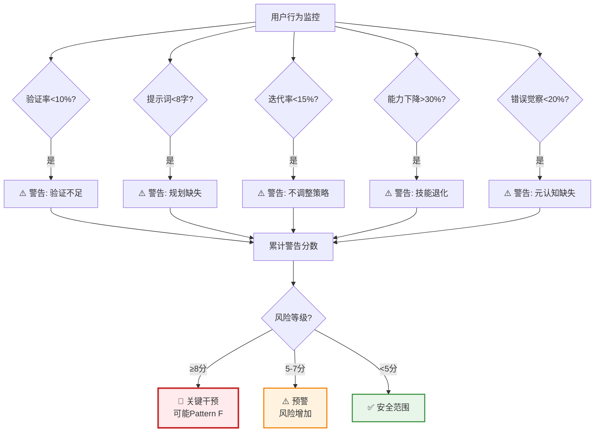
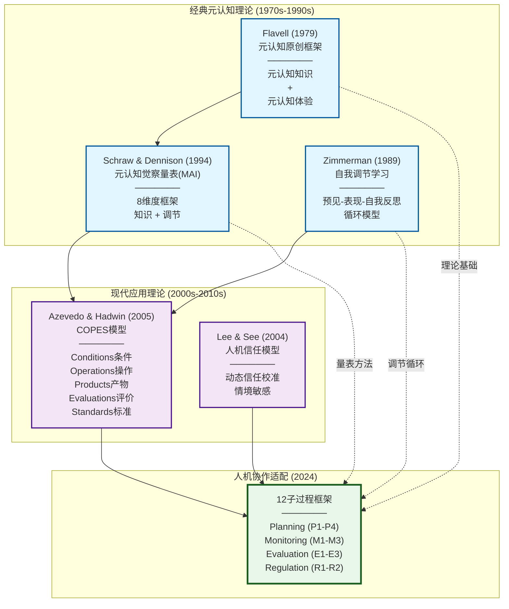
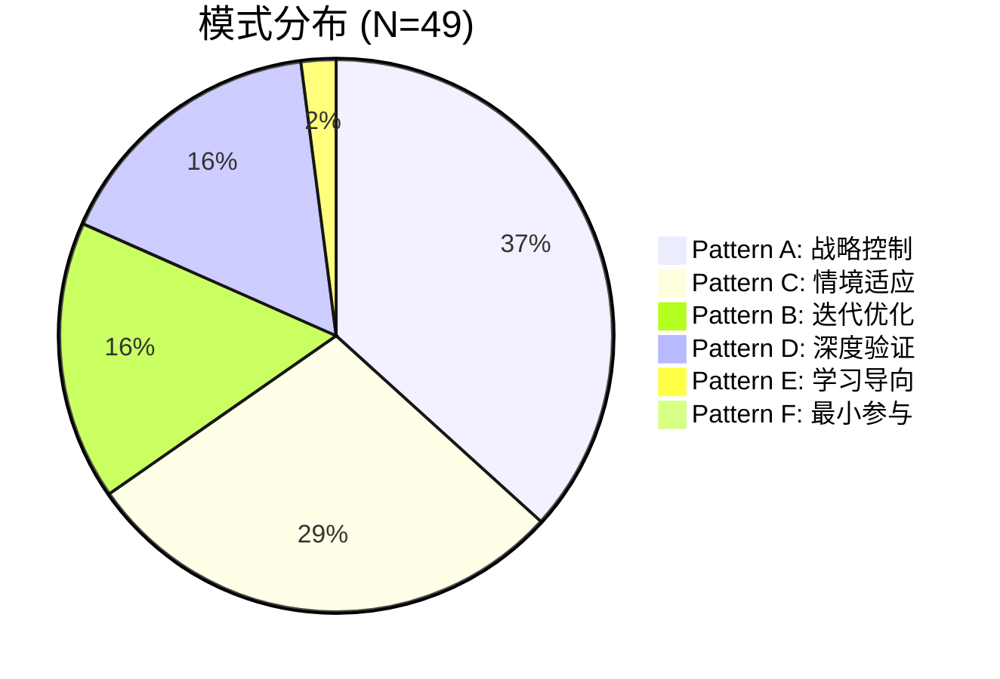
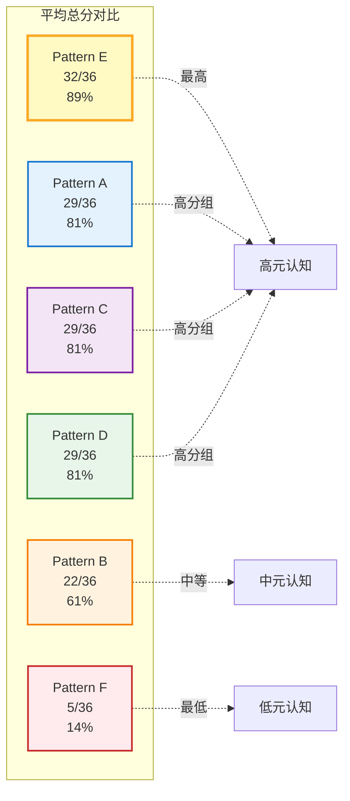
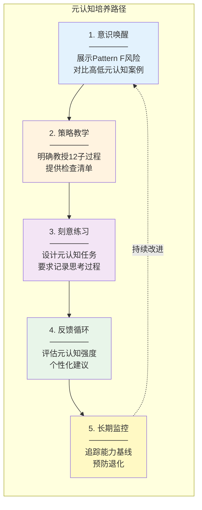

# 12子过程元认知框架可视化

> **文档来源**: 基于 `03-Pattern-Framework-Supplement.md`
> **理论基础**: Flavell (1979), Schraw & Dennison (1994), Azevedo & Hadwin (2005)
> **应用场景**: 人机协作中的元认知分析框架
> **创建日期**: 2024-11-16

---

## 📊 框架总览

### 整体架构图

```mermaid
graph TB
    subgraph META["元认知调节 (Metacognitive Regulation)"]
        direction TB

        subgraph PLANNING["🎯 规划 (Planning)<br/>行动前的认知准备"]
            P1["P1: 任务分解<br/>Task Decomposition<br/>───────<br/>理论: Miller (1956)<br/>工作记忆容量限制"]
            P2["P2: 目标设定<br/>Goal Setting<br/>───────<br/>理论: Locke & Latham (1990)<br/>目标设定理论"]
            P3["P3: 策略选择<br/>Strategy Selection<br/>───────<br/>理论: Pressley et al. (1989)<br/>策略知识"]
            P4["P4: 资源规划<br/>Resource Planning<br/>───────<br/>理论: Wegner (1987)<br/>交互记忆系统"]
        end

        subgraph MONITORING["🔍 监控 (Monitoring)<br/>执行中的持续觉察"]
            M1["M1: 进度追踪<br/>Progress Tracking<br/>───────<br/>理论: Carver & Scheier (1982)<br/>控制论模型"]
            M2["M2: 质量检查<br/>Quality Checking<br/>───────<br/>理论: Ericsson & Simon (1993)<br/>协议分析"]
            M3["M3: 上下文监控<br/>Context Monitoring<br/>───────<br/>理论: Lee & See (2004)<br/>人机信任模型"]
        end

        subgraph EVALUATION["⚖️ 评价 (Evaluation)<br/>结果的批判性判断"]
            E1["E1: 结果评估<br/>Result Evaluation<br/>───────<br/>理论: Sadler (1989)<br/>形成性评估"]
            E2["E2: 学习反思<br/>Learning Reflection<br/>───────<br/>理论: Schön (1983)<br/>反思性实践"]
            E3["E3: 能力判断<br/>Capability Judgment<br/>───────<br/>理论: Dunning-Kruger (1999)<br/>元认知准确性"]
        end

        subgraph REGULATION["🔄 调节 (Regulation)<br/>基于反馈的动态调整"]
            R1["R1: 策略调整<br/>Strategy Adjustment<br/>───────<br/>理论: Zimmerman (1989)<br/>自我调节循环"]
            R2["R2: 信任校准<br/>Trust Calibration<br/>───────<br/>理论: Spiro et al. (1988)<br/>认知灵活性理论"]
        end
    end

    PLANNING --> MONITORING
    MONITORING --> EVALUATION
    EVALUATION --> REGULATION
    REGULATION -.反馈循环.-> PLANNING

    style META fill:#f0f0f0,stroke:#333,stroke-width:3px
    style PLANNING fill:#e3f2fd,stroke:#1976d2,stroke-width:2px
    style MONITORING fill:#fff3e0,stroke:#f57c00,stroke-width:2px
    style EVALUATION fill:#f3e5f5,stroke:#7b1fa2,stroke-width:2px
    style REGULATION fill:#e8f5e9,stroke:#388e3c,stroke-width:2px
```



---

## 🔬 12子过程详细说明

### 1️⃣ 规划 (Planning) - 行动前的认知准备

#### P1: 任务分解 (Task Decomposition)
**定义**: 将复杂任务拆解为可管理的子任务序列
**理论来源**: Miller (1956) - 工作记忆容量限制 (7±2项)
**具体行为**:
- 列出子任务清单
- 画流程图
- 确定优先级
- 识别依赖关系

**评分标准**:
- 0分: 无分解，整体提交
- 1分: 简单分解（2-3步）
- 2分: 系统化分解（4-7步）
- 3分: 层级化分解（多层次结构）

---

#### P2: 目标设定 (Goal Setting)
**定义**: 明确定义预期结果和成功标准
**理论来源**: Locke & Latham (1990) - 目标设定理论
**具体行为**:
- 制定SMART目标
- 定义验收标准
- 设定时间框架
- 明确质量基准

**评分标准**:
- 0分: 无明确目标
- 1分: 模糊目标（"做得好"）
- 2分: 具体目标（可衡量）
- 3分: SMART目标（具体、可衡量、可达成、相关、有时限）

---

#### P3: 策略选择 (Strategy Selection)
**定义**: 根据任务特性选择适合的方法和工具
**理论来源**: Pressley et al. (1989) - 策略知识
**具体行为**:
- 评估备选方案
- 选择最佳方法
- 考虑工具适配性
- 预估成本效益

**评分标准**:
- 0分: 无策略选择（默认使用）
- 1分: 单一工具
- 2分: 2-3种工具切换
- 3分: 多工具编排，基于任务特征动态选择

---

#### P4: 资源规划 (Resource Planning)
**定义**: 界定人类vs AI的责任边界
**理论来源**: Wegner (1987) - 交互记忆系统 (Transactive Memory System)
**具体行为**:
- 划分职责边界
- 保护核心能力
- 定义AI辅助范围
- 建立独立优先原则

**评分标准**:
- 0分: 无边界意识
- 1分: 部分任务自己做
- 2分: 明确分工原则
- 3分: 独立优先+能力保护策略

---

### 2️⃣ 监控 (Monitoring) - 执行中的持续觉察

#### M1: 进度追踪 (Progress Tracking)
**定义**: 持续评估"我做到哪一步了"
**理论来源**: Carver & Scheier (1982) - 控制论模型
**具体行为**:
- 里程碑检查
- 时间管理
- 进度可视化
- 偏差识别

**评分标准**:
- 0分: 无进度意识
- 1分: 被动发现（任务完成时）
- 2分: 定期检查（每个子任务后）
- 3分: 实时监控（持续觉察）

---

#### M2: 质量检查 (Quality Checking)
**定义**: 实时评估输出是否符合标准
**理论来源**: Ericsson & Simon (1993) - 协议分析
**具体行为**:
- 逐行审查
- 逻辑验证
- 运行测试
- 交叉验证

**评分标准**:
- 0分: 无验证，直接使用
- 1分: 粗略检查（扫一眼）
- 2分: 系统检查（多维度）
- 3分: 深度验证（多源交叉）

---

#### M3: 上下文监控 (Context Monitoring)
**定义**: 动态调整对AI输出的信任程度
**理论来源**: Lee & See (2004) - 人机信任模型
**具体行为**:
- 情境敏感的信任调整
- 任务类型识别
- 风险评估
- 信任校准

**评分标准**:
- 0分: 固定信任（不调整）
- 1分: 二元信任（信/不信）
- 2分: 多级信任（3-5档）
- 3分: 连续校准（基于任务特征）

---

### 3️⃣ 评价 (Evaluation) - 结果的批判性判断

#### E1: 结果评估 (Result Evaluation)
**定义**: 任务完成后的全面质量判断
**理论来源**: Sadler (1989) - 形成性评估
**具体行为**:
- 多维度评估
- 与标准对照
- 同行比较
- 专家审查

**评分标准**:
- 0分: 无评估（完成即可）
- 1分: 单维度评估（能用就行）
- 2分: 多维度评估（质量+效率）
- 3分: 全面评估（质量+效率+学习+可维护性）

---

#### E2: 学习反思 (Learning Reflection)
**定义**: 识别潜在错误和后果严重性
**理论来源**: Schön (1983) - 反思性实践
**具体行为**:
- 经验总结
- 错误分析
- 策略改进
- 知识积累

**评分标准**:
- 0分: 无反思
- 1分: 事后意识（遇到问题后）
- 2分: 主动反思（记录经验）
- 3分: 系统性学习（建立知识库）

---

#### E3: 能力判断 (Capability Judgment)
**定义**: 评估"不用AI我能做到什么程度"
**理论来源**: Dunning-Kruger效应 (1999)
**具体行为**:
- 独立能力自测
- 基线对比
- 能力保护意识
- 退化监控

**评分标准**:
- 0分: 无能力觉察
- 1分: 模糊感知
- 2分: 明确判断（知道能/不能）
- 3分: 持续监控（警惕退化）

---

### 4️⃣ 调节 (Regulation) - 基于反馈的动态调整

#### R1: 策略调整 (Strategy Adjustment)
**定义**: 根据反馈修改方法
**理论来源**: Zimmerman (1989) - 自我调节循环
**具体行为**:
- 迭代改进
- 从失败学习
- 方法优化
- 持续实验

**评分标准**:
- 0分: 无调整（固定方法）
- 1分: 被动调整（失败后）
- 2分: 主动调整（3-5次迭代）
- 3分: 系统性优化（记录最佳实践）

---

#### R2: 信任校准 (Trust Calibration)
**定义**: 在不同AI/工具间灵活切换
**理论来源**: Spiro et al. (1988) - 认知灵活性理论
**具体行为**:
- 跨模型实验
- 任务差异化信任
- 降级到手工
- 工具组合使用

**评分标准**:
- 0分: 单一工具，固定信任
- 1分: 单一工具，调整信任
- 2分: 2-3种工具，任务切换
- 3分: 多工具编排，动态信任校准

---

## 🎨 模式映射可视化

### Pattern A-F 在12子过程上的强度分布



---

## 📈 模式特征对比表

### 各模式在12子过程上的平均分数

| 子过程 | Pattern A | Pattern B | Pattern C | Pattern D | Pattern E | Pattern F |
|--------|-----------|-----------|-----------|-----------|-----------|-----------|
| **P1: 任务分解** | 3.0 ⭐⭐⭐ | 2.0 ⭐⭐ | 2.0 ⭐⭐ | 2.0 ⭐⭐ | 2.0 ⭐⭐ | 0.0 ✗ |
| **P2: 目标设定** | 3.0 ⭐⭐⭐ | 1.0 ⭐ | 2.0 ⭐⭐ | 2.0 ⭐⭐ | 3.0 ⭐⭐⭐ | 0.0 ✗ |
| **P3: 策略选择** | 2.0 ⭐⭐ | 1.0 ⭐ | 3.0 ⭐⭐⭐ | 3.0 ⭐⭐⭐ | 3.0 ⭐⭐⭐ | 1.0 ⭐ |
| **P4: 资源规划** | 3.0 ⭐⭐⭐ | 1.0 ⭐ | 2.0 ⭐⭐ | 2.0 ⭐⭐ | 3.0 ⭐⭐⭐ | 0.0 ✗ |
| **M1: 进度追踪** | 2.0 ⭐⭐ | 2.0 ⭐⭐ | 2.0 ⭐⭐ | 2.0 ⭐⭐ | 3.0 ⭐⭐⭐ | 0.0 ✗ |
| **M2: 质量检查** | 3.0 ⭐⭐⭐ | 2.0 ⭐⭐ | 2.0 ⭐⭐ | 3.0 ⭐⭐⭐ | 2.0 ⭐⭐ | 0.0 ✗ |
| **M3: 上下文监控** | 2.0 ⭐⭐ | 2.0 ⭐⭐ | 3.0 ⭐⭐⭐ | 2.0 ⭐⭐ | 2.0 ⭐⭐ | 1.0 ⭐ |
| **E1: 结果评估** | 2.0 ⭐⭐ | 1.0 ⭐ | 3.0 ⭐⭐⭐ | 3.0 ⭐⭐⭐ | 3.0 ⭐⭐⭐ | 1.0 ⭐ |
| **E2: 学习反思** | 2.0 ⭐⭐ | 2.0 ⭐⭐ | 3.0 ⭐⭐⭐ | 2.0 ⭐⭐ | 3.0 ⭐⭐⭐ | 0.0 ✗ |
| **E3: 能力判断** | 3.0 ⭐⭐⭐ | 2.0 ⭐⭐ | 2.0 ⭐⭐ | 3.0 ⭐⭐⭐ | 3.0 ⭐⭐⭐ | 0.0 ✗ |
| **R1: 策略调整** | 2.0 ⭐⭐ | 3.0 ⭐⭐⭐ | 3.0 ⭐⭐⭐ | 2.0 ⭐⭐ | 3.0 ⭐⭐⭐ | 1.0 ⭐ |
| **R2: 信任校准** | 2.0 ⭐⭐ | 3.0 ⭐⭐⭐ | 2.0 ⭐⭐ | 3.0 ⭐⭐⭐ | 2.0 ⭐⭐ | 1.0 ⭐ |
| **总分** | **29/36** | **22/36** | **29/36** | **29/36** | **32/36** | **5/36** |
| **百分比** | 81% | 61% | 81% | 81% | 89% | 14% |

---

## 🔍 模式识别决策树



---

## 🎯 模式核心公式

### Pattern A - Strategic Control
```
Pattern A = High(P1, P2, P4) + High(M2) + High(E3)

必要条件:
- P1 (任务分解) ≥ 2
- P4 (资源规划) ≥ 2
- M2 (质量检查) ≥ 2
- E3 (能力判断) ≥ 2

充分条件:
- P1 + P4 + M2 + E3 ≥ 10

核心逻辑:
1. 前期大量规划 (P1, P2)
2. 明确边界 (P4: 独立优先)
3. 严格监控 (M2: 系统验证)
4. 持续能力自检 (E3: 警惕退化)
```

### Pattern B - Iterative Trial
```
Pattern B = High(R1, R2) + Dynamic(M3) + Tolerance(Failure)

必要条件:
- R1 (策略调整) ≥ 2
- R2 (信任校准) ≥ 2

充分条件:
- R1 + R2 ≥ 5

核心逻辑:
1. 快速实验 (R1: 3-7次迭代)
2. 灵活切换工具 (R2)
3. 从失败中学习
4. 逐步校准信任 (M3)
```

### Pattern C - Context-Adaptive
```
Pattern C = Dynamic(ALL) + Context-Aware

必要条件:
- M3 (上下文监控) ≥ 2
- E1 (结果评估) ≥ 2
- E2 (学习反思) ≥ 2

充分条件:
- M3 + E1 + E2 ≥ 7

核心逻辑:
1. 首先评估任务特征 (E2: 风险? 熟悉度?)
2. 动态选择策略 (P3)
3. 信任随情境变化 (M3: 5%-90%)
4. 灵活调整 (R1)

本质: 多策略用户，根据情境在Pattern A/B/D间切换
```

### Pattern D - Deep Verification
```
Pattern D = Extreme(Verification) + Low(Trust)

必要条件:
- M2 (质量检查) = 3 (满分)
- E1 (结果评估) ≥ 2
- E2 (学习反思) ≥ 2

充分条件:
- M2 + E1 + E2 + R2 ≥ 10

核心逻辑:
1. 假设所有输出有误 (E2)
2. 系统化验证流程 (M2: 5步检查)
3. 多工具交叉验证 (R2)
4. 批判性质询 (5 Whys technique)

验证率 > 90%
```

### Pattern E - Learning-Oriented
```
Pattern E = Learning-Oriented + High(Reflection)

必要条件:
- E2 (学习反思) ≥ 2
- E3 (能力判断) ≥ 2
- P2 (目标设定) ≥ 2

充分条件:
- E1 + E2 + E3 ≥ 8

核心逻辑:
1. 目标是学习，不只是完成任务 (P2)
2. 持续自我监控"我理解多少？" (E3)
3. AI作为教学工具而非任务工具
4. 维护学习日志 (E2)
5. 后续独立练习验证 (E3)
```

### Pattern F - Minimal Engagement
```
Pattern F = Absence(Metacognition)

必要条件:
- 总分 < 15

充分条件:
- 总分 < 15 且至少6个子过程 = 0

核心特征:
1. 无规划 (直接提问)
2. 无监控 (不检查理解)
3. 无评价 (不验证输出)
4. 无调节 (不迭代)

关键: 这不是"替代策略"，是"策略缺失"
```

---

## 💡 情境切换机制

### 合理切换路径



### 切换触发因素

| 触发因素 | 切换方向 | 示例 |
|---------|---------|------|
| **熟悉度下降** | Pattern C → Pattern A | 新技术栈，加强规划和验证 |
| **风险升高** | Pattern C → Pattern D | 生产环境代码，启动深度验证 |
| **时间压力** | Pattern E → Pattern C | Deadline临近，效率优先 |
| **学习机会** | Pattern C → Pattern E | 充裕时间，深度理解 |
| **探索阶段** | Pattern A → Pattern B | 不确定方法，快速实验 |
| **方法确定** | Pattern B → Pattern A | 找到最佳实践，系统化控制 |

### ⚠️ 预防退化



---

## 📚 理论溯源图

### 12子过程的理论谱系



---

## 🔬 实证验证

### 基于49位受访者的模式分布



### 跨模式元认知强度对比



---

## 📖 引用本框架

### 学术引用格式

**APA格式**:
```
本研究基于元认知理论文献（Flavell, 1979; Schraw & Dennison, 1994;
Azevedo & Hadwin, 2005），构建了涵盖4类高阶过程（规划、监控、评价、调节）
的12子过程分类框架。该框架改编自Flavell的元认知原创理论，整合了Schraw
和Dennison的元认知觉察量表，并扩展了Azevedo和Hadwin的自我调节学习模型，
以适应人类-AI协作的特定情境。
```

### 核心文献

1. **Flavell, J. H. (1979).** Metacognition and cognitive monitoring: A new area of cognitive-developmental inquiry. *American Psychologist, 34*(10), 906-911.

2. **Schraw, G., & Dennison, R. S. (1994).** Assessing metacognitive awareness. *Contemporary Educational Psychology, 19*(4), 460-475.

3. **Azevedo, R., & Hadwin, A. F. (2005).** Scaffolding self-regulated learning and metacognition–Implications for the design of computer-based scaffolds. *Instructional Science, 33*(5-6), 367-379.

4. **Zimmerman, B. J. (1989).** A social cognitive view of self-regulated academic learning. *Journal of Educational Psychology, 81*(3), 329-339.

5. **Lee, J. D., & See, K. A. (2004).** Trust in automation: Designing for appropriate reliance. *Human Factors, 46*(1), 50-80.

---

## 💻 实施代码示例

### Pattern识别算法 (Python)

```python
def detect_pattern(subprocess_scores: dict) -> str:
    """
    基于12子过程分数识别元认知模式

    Args:
        subprocess_scores: {
            'P1': 2.5, 'P2': 3.0, 'P3': 2.0, 'P4': 3.0,
            'M1': 2.0, 'M2': 3.0, 'M3': 2.0,
            'E1': 2.0, 'E2': 2.0, 'E3': 3.0,
            'R1': 2.0, 'R2': 2.0
        }

    Returns:
        Pattern label: 'A', 'B', 'C', 'D', 'E', or 'F'
    """
    total = sum(subprocess_scores.values())

    # Pattern F: 元认知缺失
    if total < 15:
        return 'F'

    # Pattern E: 学习导向
    if (subprocess_scores['E2'] >= 2 and
        subprocess_scores['E3'] >= 2 and
        subprocess_scores['P2'] >= 2 and
        subprocess_scores['E1'] + subprocess_scores['E2'] + subprocess_scores['E3'] >= 8):
        return 'E'

    # Pattern A: 战略控制
    if (subprocess_scores['P1'] >= 2 and
        subprocess_scores['P4'] >= 2 and
        subprocess_scores['M2'] >= 2 and
        subprocess_scores['E3'] >= 2 and
        subprocess_scores['P1'] + subprocess_scores['P4'] +
        subprocess_scores['M2'] + subprocess_scores['E3'] >= 10):
        return 'A'

    # Pattern D: 深度验证
    if (subprocess_scores['M2'] == 3 and
        subprocess_scores['E1'] >= 2 and
        subprocess_scores['E2'] >= 2):
        return 'D'

    # Pattern B: 迭代优化
    if (subprocess_scores['R1'] >= 2 and
        subprocess_scores['R2'] >= 2 and
        subprocess_scores['R1'] + subprocess_scores['R2'] >= 5):
        return 'B'

    # Pattern C: 情境适应 (default for mid-range scores)
    if (subprocess_scores['M3'] >= 2 and
        subprocess_scores['E1'] >= 2):
        return 'C'

    # Fallback
    return 'C' if total >= 20 else 'B'


# 示例使用
example_scores = {
    'P1': 3, 'P2': 3, 'P3': 2, 'P4': 3,
    'M1': 2, 'M2': 3, 'M3': 2,
    'E1': 2, 'E2': 2, 'E3': 3,
    'R1': 2, 'R2': 2
}

pattern = detect_pattern(example_scores)
print(f"检测到的模式: Pattern {pattern}")  # 输出: Pattern A
```

### Pattern F风险监控

```python
def check_pattern_f_risk(user_behavior: dict) -> dict:
    """
    监控Pattern F（元认知缺失）风险

    Args:
        user_behavior: {
            'verificationRate': 0.05,      # 验证率
            'avgPromptLength': 6,          # 平均提示词长度
            'iterationFrequency': 0.10,    # 迭代频率
            'skillDecline': 0.35,          # 能力下降率
            'errorAwareness': 0.15         # 错误觉察率
        }

    Returns:
        {
            'risk_level': 'critical' | 'warning' | 'safe',
            'red_flags': int,
            'interventions': List[str]
        }
    """
    red_flags = 0
    interventions = []

    # 信号1: 验证率极低
    if user_behavior['verificationRate'] < 0.10:
        red_flags += 3
        interventions.append("启用强制验证提示")

    # 信号2: 提示词过简
    if user_behavior['avgPromptLength'] < 8:
        red_flags += 2
        interventions.append("教授有效提示词策略")

    # 信号3: 从不迭代
    if user_behavior['iterationFrequency'] < 0.15:
        red_flags += 2
        interventions.append("鼓励迭代改进")

    # 信号4: 能力基线下降
    if user_behavior['skillDecline'] > 0.30:
        red_flags += 3
        interventions.append("触发能力保护警告")

    # 信号5: 无错误觉察
    if user_behavior['errorAwareness'] < 0.20:
        red_flags += 3
        interventions.append("展示典型错误案例")

    # 确定风险等级
    if red_flags >= 8:
        risk_level = 'critical'
    elif red_flags >= 5:
        risk_level = 'warning'
    else:
        risk_level = 'safe'

    return {
        'risk_level': risk_level,
        'red_flags': red_flags,
        'interventions': interventions
    }
```

---

## 📊 附录: 完整评分示例

### 案例: 高分Pattern A用户

**背景**: 博士生，计算化学专业，使用ChatGPT辅助研究

**12子过程评分**:

| 子过程 | 分数 | 证据 |
|--------|------|------|
| P1: 任务分解 | 3 | "我先把论文写作分成：文献综述、方法、结果、讨论四部分，每部分再细分" |
| P2: 目标设定 | 3 | "我要求每段必须有主题句、3个支撑证据、1个过渡句" |
| P3: 策略选择 | 2 | "文献用ChatGPT，代码用GitHub Copilot" |
| P4: 资源规划 | 3 | "核心算法必须我自己推导，AI只能帮我优化代码格式" |
| M1: 进度追踪 | 2 | "我用Notion追踪每个子任务完成情况" |
| M2: 质量检查 | 3 | "每段AI生成后，我逐句对照原文献，确保没有曲解" |
| M3: 上下文监控 | 2 | "文献综述信任70%，数学推导信任20%" |
| E1: 结果评估 | 2 | "最终检查：逻辑、格式、引用、原创性四维度" |
| E2: 学习反思 | 2 | "我记录了'GPT容易错的10个地方'，下次避免" |
| E3: 能力判断 | 3 | "我每月做一次'无AI练习'，确保自己能独立完成" |
| R1: 策略调整 | 2 | "发现GPT理解不了专业术语，改用更通俗的描述" |
| R2: 信任校准 | 2 | "升级到GPT-4后，代码信任从60%提升到80%" |
| **总分** | **29/36** | **Pattern A - 战略控制** |

---

## 🎓 教学应用

### 培养高元认知的教学策略



---

## ✅ 核心要点总结

### 理论创新
1. **首次系统化**: 将经典元认知理论应用于人机协作场景
2. **可操作化**: 12个子过程均有明确行为指标，支持定量分析
3. **实证验证**: 基于49位受访者的深度访谈数据

### 实践价值
1. **模式识别**: 基于行为而非背景，避免刻板印象
2. **风险预警**: Pattern F早期识别，预防能力退化
3. **情境支持**: 承认合理切换，支持多样性

### 设计指导
1. **不是**: 强制所有人成为Pattern A或D
2. **而是**: 预防Pattern F形成，支持Pattern A-E多样性
3. **核心**: 减少有效策略的摩擦，保持认知参与

---

**文档版本**: v1.0
**基于**: 03-Pattern-Framework-Supplement.md
**理论基础**: Flavell (1979), Schraw (1994), Azevedo (2005)
**创建日期**: 2024-11-16
**适用场景**: 学术研究、系统设计、教学应用
